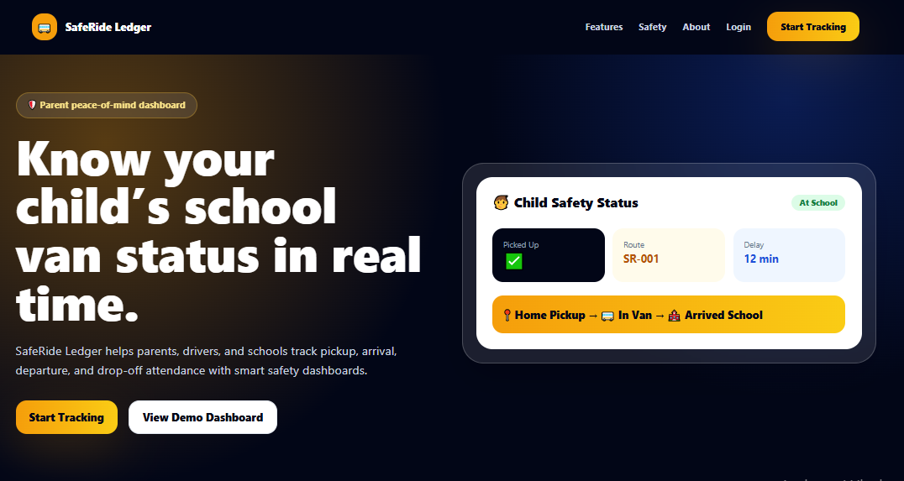
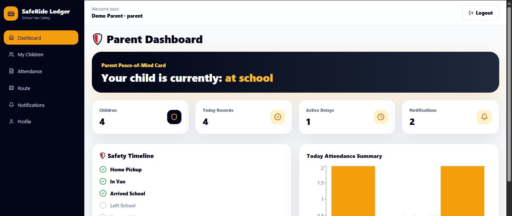

<div align="center">

# 🚌 SafeRide Ledger
### 🛡️ School Van Safety & Attendance App


<br/>


**Premium dark-blue and gold MERN school van safety app with parent, driver, and admin dashboards, pickup/drop tracking, safety timelines, delay reports, QR demo check-ins, emergency contacts, analytics, and CSV reports.**

</div>

---

## 📸 Project Preview

<div align="center">


<br/><br/>

<br/><br/>

<br/><br/>

<br/><br/>


</div>

---

## 🚀 Overview

**SafeRide Ledger** solves a real school transport problem: parents often do not know whether their child boarded the school van, reached school, left school, or was dropped safely. This app provides role-based dashboards for parents, drivers, and admins with daily attendance, status timelines, route details, delay notifications, and reports.

> Safety Scope: This app is for school transport coordination and attendance communication only. It does not replace human supervision, school policy, emergency services, or legal responsibility. Location and QR features are demo-only unless real integrations are configured.

## ✨ Key Features

- 👨‍👩‍👧 Parent / Driver / Admin roles
- 🔐 JWT auth and bcrypt password hashing
- 🧒 Student profiles with emergency contacts
- 🚌 Route and vehicle management
- ✅ Pickup / arrival / departure / drop-off workflow
- 🛡️ Parent peace-of-mind status card
- 🕒 Safety timeline
- 📍 Route stop timeline
- 🚨 Delay report and notification center
- 🔑 QR demo check-in using student code
- 📊 Admin safety score and analytics
- 📄 Daily attendance CSV reports
- 🎨 Premium dark blue and gold SaaS UI

## ⚙️ Run Locally

```bash
docker compose up -d mongo
```

```bash
cd backend
npm install
copy .env.example .env
npm run dev
```

```bash
cd frontend
npm install
copy .env.example .env
npm run dev
```

## 🔑 Demo Accounts

```text
Admin:  admin@example.com  / Admin12345
Parent: parent@example.com / Parent12345
Driver: driver@example.com / Driver12345
```

## 📌 CV Bullet

> Developed SafeRide Ledger, a MERN-based school van safety and attendance app with parent, driver, and admin dashboards, pickup/drop attendance tracking, route management, delay notifications, emergency contacts, QR demo check-ins, safety timelines, analytics, and CSV reports.
